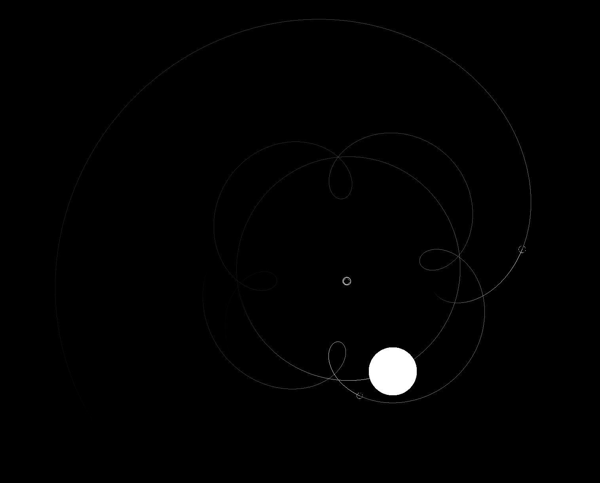

# a-N-other Body Simulator?
An interactive N-Body simulator for exploring Newtonian gravity! Can be used for visualizing Lagrange points, 3-body instability, epicycles and apparent retrograde motion, and maybe more?



## Simulation Info

### Libraries

1. [SDL3 & SDL_gpu](https://libsdl.org/) - Cross platform input, windowing, and rendering
2. [SDL_shadercross](https://github.com/libsdl-org/SDL_shadercross) - Cross platform shaders
3. [Dear ImGui](https://github.com/ocornut/imgui) & [dear_bindings](https://github.com/dearimgui/dear_bindings) - Immediate mode user interface (with C bindings)
4. [stb_ds.h](https://github.com/nothings/stb/blob/master/stb_ds.h) - Generic dynamic arrays
5. [HandmadeMath.h](https://github.com/HandmadeMath/HandmadeMath) - Simple graphic-focused math library

## Building and running

### Required build dependencies
1. [Git](https://git-scm.com/) - Version control
2. [CMake](https://cmake.org/) - Cross platform build system and dependency control
3. [Python 3](https://www.python.org/) - For generating ImGui bindings and compiling shaders
4. [glslang](https://github.com/KhronosGroup/glslang/releases) - For compiling GLSL shaders to SPIR-V

### Steps

1. Clone repository

    ```bash
    git clone https://github.com/cbass-space/n-body.git
    cd n-body
    ```

2. Setup up Python build environment

    ```bash
    python3 -m venv .venv
    source .venv/bin/activate  # macos
    .venv\Scripts\Activate.psl # windows
    pip install ply==3.11
    ```

3. Generate CMake profile, build & run

    ```bash
    cmake -B build -DCMAKE_BUILD_TYPE=Debug
    cd build && cmake --build .
    ./n-body
    ```

## Todo!

1. <s>Barnes Hut optimization</s> way to complicated for compute shaders (for me small brain anyway)
2. Normalize constants
3. Gravitational field visualizer
   - field lines, equipotential lines, test mass motion
4. Test mass/satellite exploration
   - find a way of visualizing Hohmann Transfers, Interplanetary Transport Networks (and manifolds?)
5. Save/load system
6. Forces visualizations for Lagrange Points
